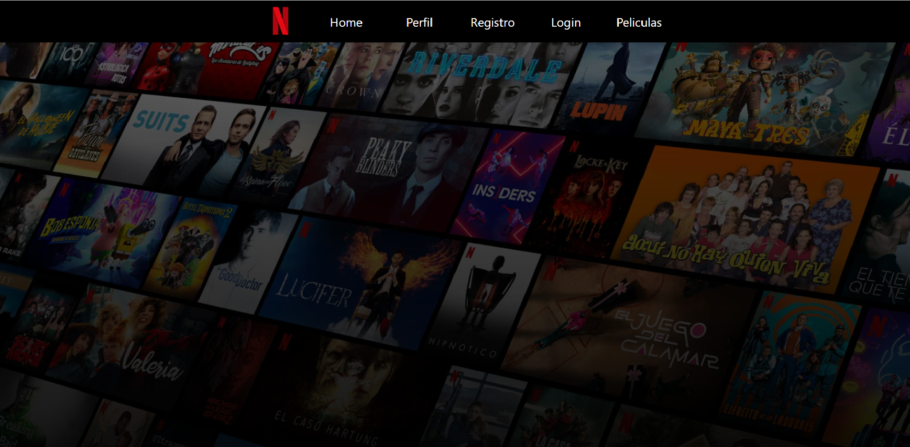
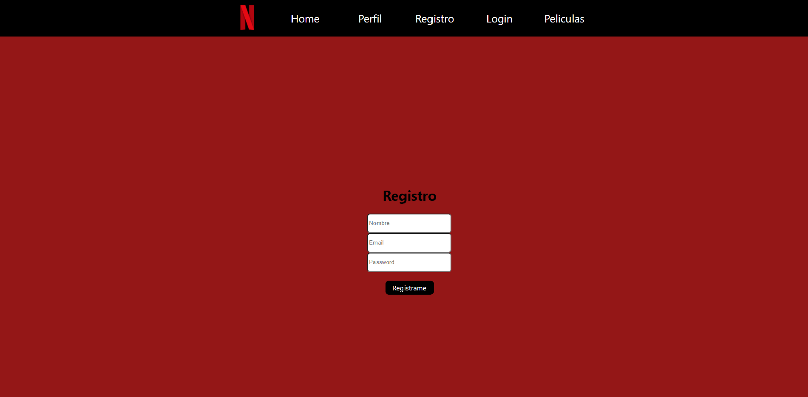
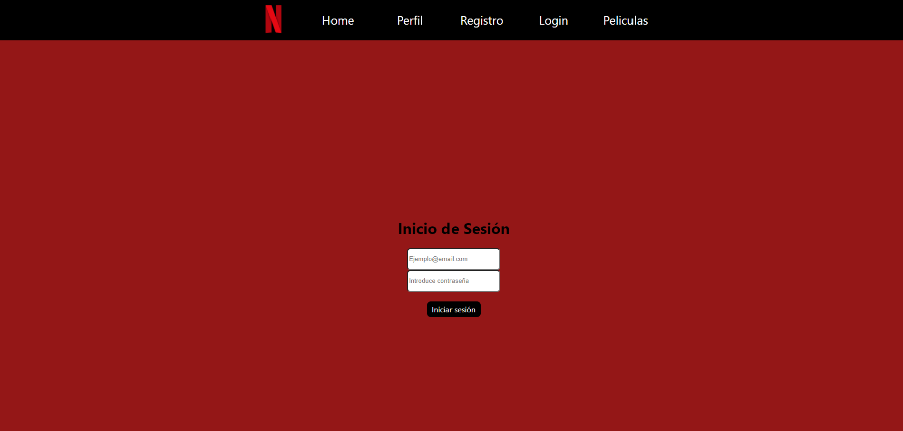
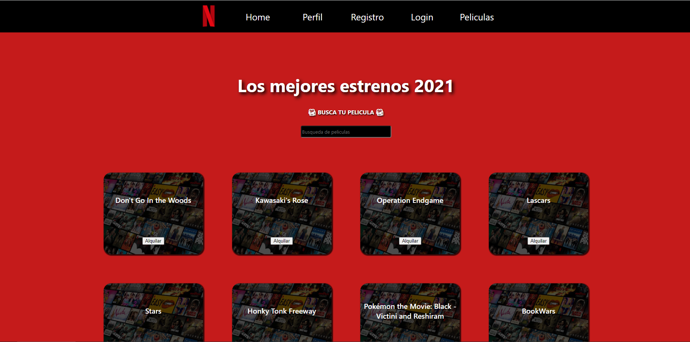
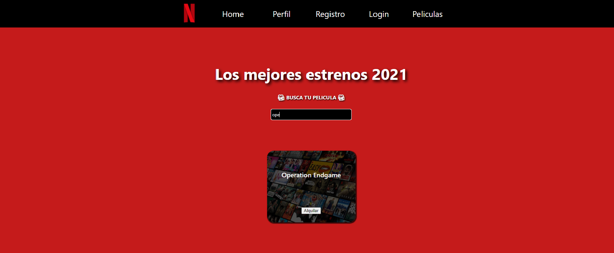
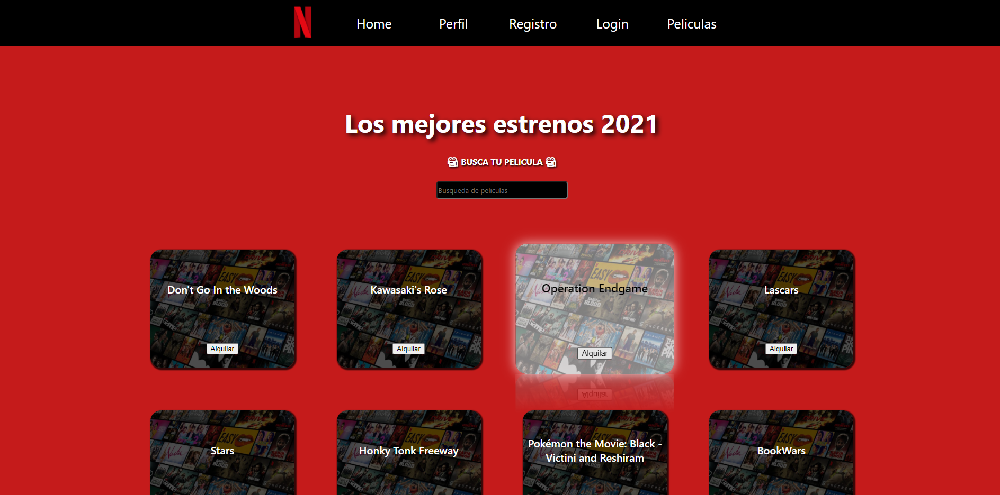
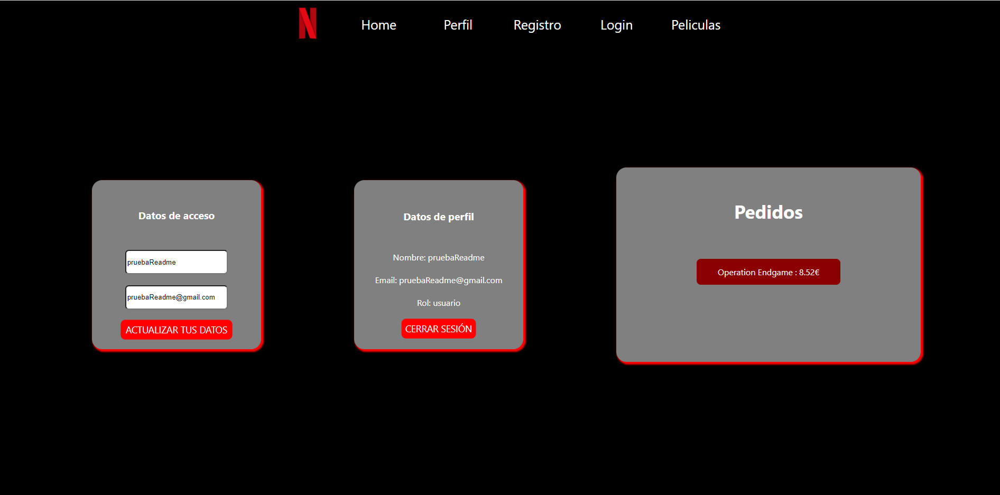
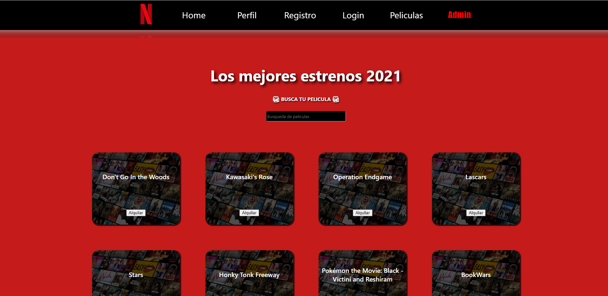

# ReactApiBackendyFrontedPeliculas
La APP se encuentra desplegada en AWS en el siguiente enlace:https://main.d6nspdk8tl3p5.amplifyapp.com/  💻 📲

En este proyecto me he inspirado en la plataforma Netflix.🎬
Las tecnologias usadas en este proyecto son las siguientes:📔

⚙️--->React JS
⚙️--->MongoDB
⚙️--->CSS3
⚙️--->REDUX
⚙️--->AXIOS
⚙️--->JWT

<h1>📺Pantallas:</h1>

<h2>Pantalla Home:</h2>

  

<h2>Pantalla de registro de los usuarios:</h2>

  

Requiere: 'Nombre,Email,Contraseña'
El nombre no debe contener solo números,el email debe contener @ y punto,la contraseña debe tener un mínimo de 8 carácteres.

<h2>Pantalla de login:</h2>

  

Aquí el usuario inicia sesión , si todo es correcto sera redirigido a la pantalla Películas.

<h2>Pantalla de Películas:</h2>

  

En esta pantalla se encuentran todas las películas,también se puede buscar en su respectivo buscador como muestro en la siguiente imagen---->

  

<h2>Alquiler de película y pantalla de perfil:</h2>

Aquí muestro como dando click en el botón 'Alquilar' se añadiria a tu perfil,
El cual podrias ver su información (ℹ️)
Actualizar el perfil 🔄
Cerrar sesión 🚪

  

  

<h2>Pantalla Admin:</h2>

Al hacer un login como Administrador se despliega una nueva opción en el navegador de menus el cual es administrador, en el cual, se pueden ver sus pedidos, borrar y añadir películas.

  

 
<h1>Agradecimientos:</h1>

😁A todos los compañeros que me ayudaron a resolver dudas,también a David Ochando y a Jose Marín.😁
